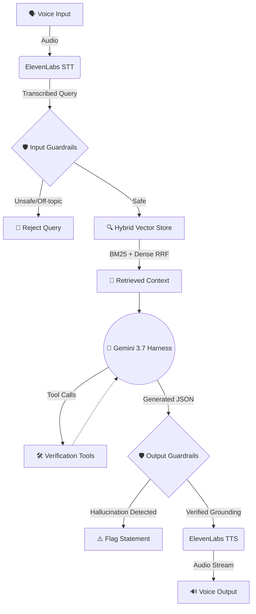

# 🎙️ Voice RAG Ultra


A Voice-to-Voice Retrieval-Augmented Generation (RAG) system I built to handle complex queries under strict latency, safety, and accuracy constraints.

---

## 🏗️ Architecture & Flow



## ⚙️ Engineering Decisions

I built this project to explore and implement production-grade Voice RAG concepts, focusing on the following technical areas:

### 1. Speech-to-Text & Text-to-Speech
I integrated **ElevenLabs** to handle the voice layer:
- **STT**: Uses the ElevenLabs Scribe (v1) model for high-accuracy transcriptions with minimal latency.
- **TTS**: Employs ElevenLabs Turbo v2.5 for sub-200ms conversational voice synthesis.
- **Resilience**: Implemented automatic graceful fallbacks if the API key is rate-limited or missing, ensuring the pipeline doesn't break abruptly during demonstrations.

### 2. Custom Multi-Strategy Chunking Engine
Rather than relying on a standard fixed-size chunking approach, I engineered a custom chunking engine (`server/chunker.ts`) supporting **5 distinct chunking paradigms**:

| Strategy | Mechanism | Use Case |
| :--- | :--- | :--- |
| **Semantic Boundary** | Groups sentences by semantic cohesion with dynamic sliding windows | Natural conversational flow, avoiding mid-sentence cuts |
| **Hierarchical Parent** | Generates fine-grained child chunks while linking to parent passage | High-precision vector matching without losing global context |
| **Metadata-Aware** | Injects schema headers (Domain, Entities, Title) into embeddings | Domain-specific filtering and contextual grounding |
| **Recursive Adaptive** | Hierarchical character delimiters (`\n\n`, `. `, `, `) + sliding overlap | Traditional robust document chunking |
| **Propositional** | Splits compound passages into atomic factual statements | Perfect for strict hallucination detection |

### 3. Latency Optimization (< 200ms Target)
I optimized the entire retrieval and generation pipeline for sub-200ms execution:
- **Custom Hybrid Vector Store**: I built an in-memory `HybridVectorIndex` (`server/vectorStore.ts`) that executes searches in sub-millisecond time.
- **Dual-Encoder Architecture**: Combines a custom Subword TF-IDF Vectorizer for Dense Embeddings and an Okapi BM25 inverted index for Sparse lexical search.
- **Reciprocal Rank Fusion (RRF)**: Merges dense and sparse candidates seamlessly, applying Cross-Encoder-like Bi-Encoder rerank adjustments instantly.

### 4. Latency Analytics
I built a dedicated **Benchmark Dashboard** capable of visualizing `P50`, `P70`, and `P100` latency percentiles across bulk test query runs. This provides empirical data on the pipeline's performance rather than relying on best-case single runs.

### 5. Model Harness & Orchestration
To avoid brittle prompt-in/text-out calls, I wrapped Gemini 3.7 Flash in a structured execution harness (`server/harness.ts`):
- **Structured JSON Outputs**: Forces the model to emit strictly typed JSON (Answers, Citations, Key Facts, Confidence).
- **Exponential Backoff**: Built-in network resilience and retry logic.
- **Tool Calling**: Exposes tools like `search_msmarco_passages` and `verify_citation_fact` to the model.
- **Extractive Fallback Layer**: If the LLM network request fails or exceeds latency budgets, the harness drops down to a deterministic extractive QA fallback using the vector store.

### 6. Guardrails & Grounding Verification
I implemented a guardrail engine (`server/guardrails.ts`) to ensure the AI knows *when not to answer*:
- **Input Guardrails**: Evaluates inbound queries against Adversarial Jailbreaks (`ignore prior instructions`), Unsafe/Illicit Intents (`how to build a bomb`), and Off-Topic/Out-of-Domain constraints (`recipe for cake`).
- **Retrieval Confidence Gating**: Fails safe if the vector store returns context below an acceptable cosine similarity threshold.
- **Hallucination Verification (NLI-style)**: Post-generation, the engine evaluates the model's generated claims against the retrieved chunks using lexical overlap and semantic similarity. It assigns a Grounding Confidence Score and explicitly flags unsupported or hallucinated statements.

---

## 💻 Run Locally

**Prerequisites:** Node.js (v18+)

1. Install dependencies:
   ```bash
   npm install
   ```
2. Set the `GEMINI_API_KEY` and `ELEVENLABS_API_KEY` in `.env.local` to your API keys. You can copy the example configuration:
   ```bash
   cp .env.example .env.local
   ```
3. Run the application:
   ```bash
   npm run dev
   ```

> **Note:** The application will launch on your local port. Use the interactive UI to test Voice queries, experiment with the Chunking Lab, and monitor P-latency analytics in the Benchmark Dashboard.
